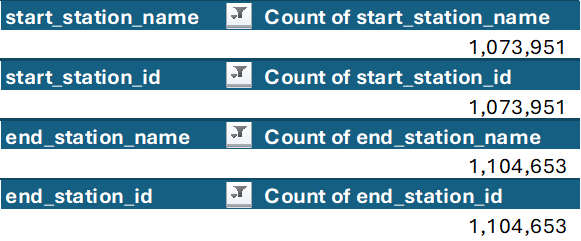

# Documentation of Data Preparation

1. Use Power Query to compile the twelve separate .csv files into one worksheet. We find that there are `5,860,568` records in the compiled dataset.
2. Add the following fields and convert each field into their correct data types for analysis:
    1. `day_of_week_number`
    2. `day_of_week_name`
    3. `week_of_month_number`
    4. `month_number`
    5. `month_name`
    6. `quarter_of_year`
    7. `ride_duration`
3. Find the fields with missing values using Power Query. Note that the station name and corresponding station ID have equal number of missing records. Using PivotTable, we find the total number of missing values in the following fields.:

    1. `start_station_name` have `1,073,951` missing records.
    1. `start_station_id` have `1,073,951` missing records.
    1. `end_station_name` have `1,104,653` missing records.
    1. `end_station_id` have `1,104,653` missing records.

    

4. Use Power Query to remove the missing and null values. Subsequently, we now have `4,208,309` records.

See the [cleaned dataset](https://docs.google.com/spreadsheets/d/16DbFXjMv1KIGHlTEf1kW8DJuFniwl2-p/edit?usp=sharing&ouid=102786533366214242942&rtpof=true&sd=true). Note that the dataset can be accessed using Power Query.
