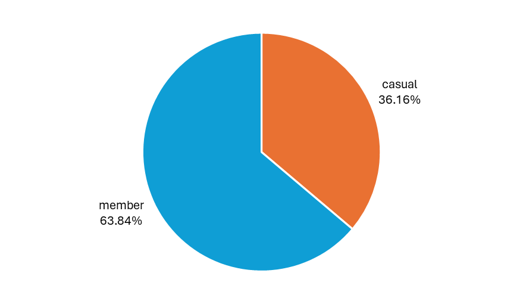
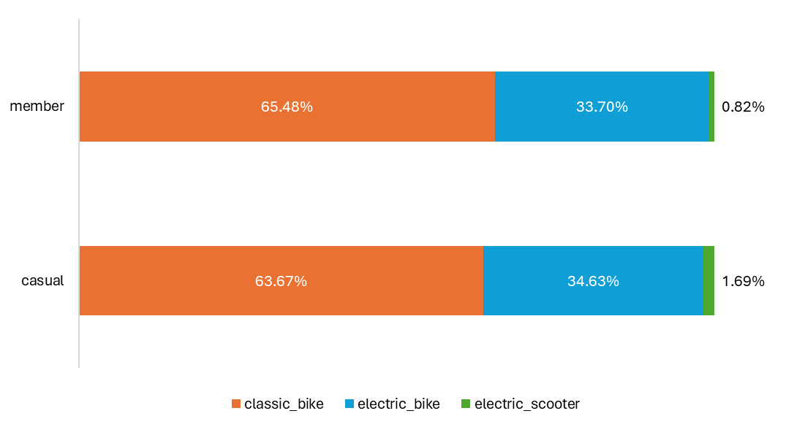
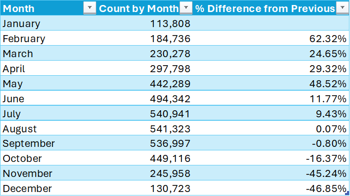

# Preliminary Analysis

This preliminary analysis deliverable contains the rough gathering of insights from the cleaned dataset, conveyed using the form of question and answer.

See the figures obtained in this report [here](insert uploaded excel file here).

## 1. What is the distribution and proportion of riders in terms of the type of bike used?

-   `2,728,147` riders, around `64.83%` of all riders in 2024, use classic bikes.
-   `1,432,335` riders, around `34.04%` of all riders in 2024, use electric bikes.
-   `47,827` riders, the remaining `1.14%` of all riders in 2024, use electric scooters.

## 2. What is the distribution and proportion of riders in terms of membership type?

-   `2,728,147` riders, around `63.84%` of all riders in 2024, are members.
-   `1,521,621` riders, around `36.16%` of all riders, are only casual users.

## 3. How does the distribution and proportion of bike types differ between members and casual riders?

-   Members who avail classic bikes are greater than casual riders.
-   Members who avail electric bikes are greater than casual riders.
-   Casual riders who avail electric scooters are greater than members.

> Knowing that there are more casual members who use electric scooters could be one lead.

## 4. What are the top 40 start stations? What are the top 40 end stations?

## 5. Which of the top 40 start stations are also in end stations? Among the start and end stations, which stations are not present in one or the other?

## 6. What is the average and maximum ride duration? What is the total count?

