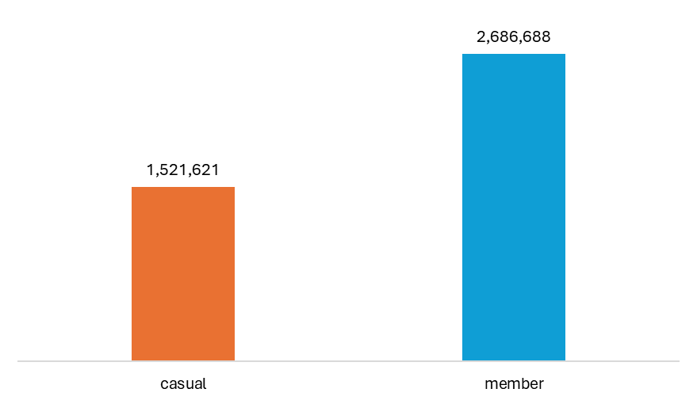
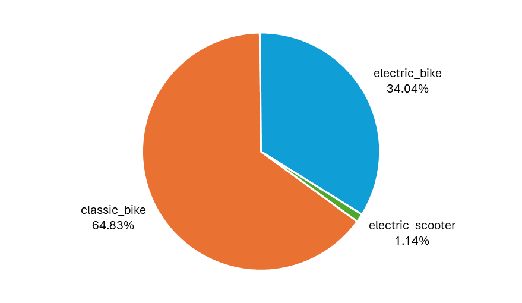
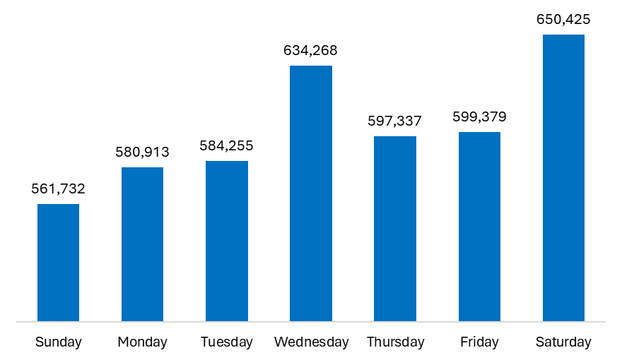
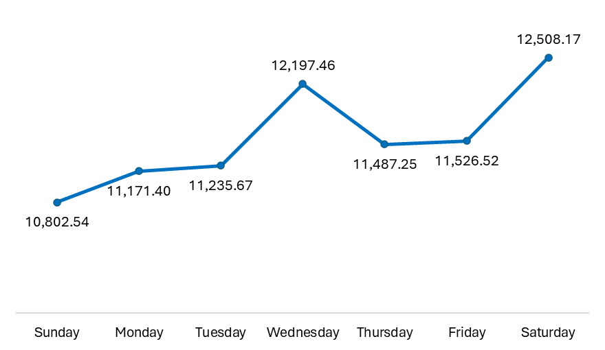
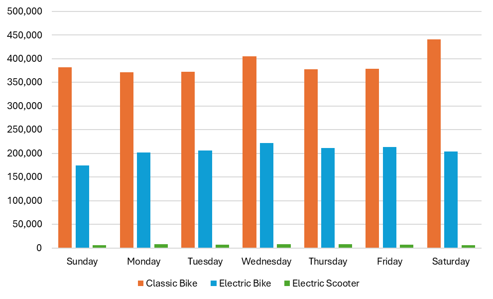
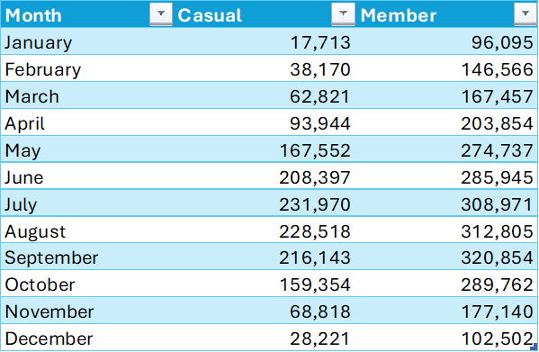

# Preliminary Analysis

This preliminary analysis deliverable contains the rough gathering of insights from the cleaned dataset, conveyed using the form of question and answer.

See the figures obtained in this report [here](insert uploaded excel file here).

## 1. What is the distribution and proportion of riders in terms of the type of bike used?

-   `2,728,147` riders, around `64.83%` of all riders in 2024, use classic bikes.
-   `1,432,335` riders, around `34.04%` of all riders in 2024, use electric bikes.
-   `47,827` riders, the remaining `1.14%` of all riders in 2024, use electric scooters.

## 2. What is the distribution and proportion of riders in terms of membership type?

-   `2,728,147` riders, around `63.84%` of all riders in 2024, are members.
-   `1,521,621` riders, around `36.16%` of all riders, are only casual users.

## 3. How does the distribution and proportion of bike types differ between members and casual riders?

-   Members who avail classic bikes are greater than casual riders.
-   Members who avail electric bikes are greater than casual riders.
-   Casual riders who avail electric scooters are greater than members.

> Knowing that there are more casual members who use electric scooters could be one lead.

## 4. What are the top 40 start stations? What are the top 40 end stations?

## 5. Which of the top 40 start stations are also in end stations? Among the start and end stations, which stations are not present in one or the other?

-   Most stations in the top 40 start stations are also in the top 40 end stations.
-   Only two stations each in the two top 40 lists are not in the other list.

## 6. What is the average and maximum ride duration? What is the total count?

-   While there are more around `76%` more members than casual riders, casual riders have longer ride durations than members.

## 7. What is the trend during a typical week?

-   The ride duration is higher during the weekends (`Sunday` and `Saturday`) compared to the weekdays.

-   The number of riders are higher during `Wednesday` and `Saturday`.

## 8. What is the monthly trend of 2024?

-   Months from April to October have longer ride durations and higher number of riders compared to months from January to April and November to December.
-   Months from April to October pass the 15-minute mark. That is, riders bike for at least 15 minutes on average.

## 9. What is the quarterly trend of 2024?

-   Since we found longer ride durations and higher number of bike rides from April to October, it only makes sense that quarters 2 and 3 are found to have longer ride durations and higher number of bike rides, as well.

## 10. How do these trends differ between the casual riders and members?
