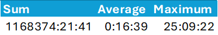
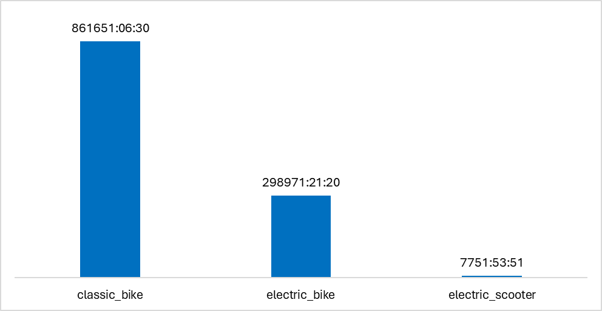
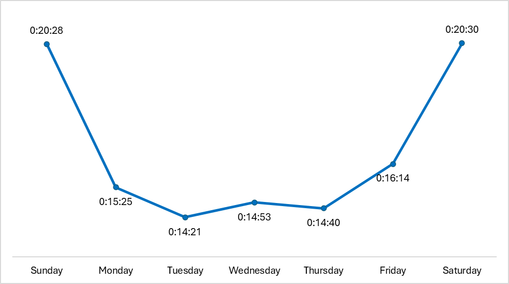

# Preliminary Analysis

This preliminary analysis deliverable contains the rough gathering of insights from the cleaned dataset, conveyed using the form of question and answer.

See the figures obtained in this report [here](https://docs.google.com/spreadsheets/d/1WOKB3_DJXcglaHmOiyEX2y2Bf1aIcE8D/edit?usp=sharing&ouid=102786533366214242942&rtpof=true&sd=true).

## Insights

-   A majority of the riders use classic bikes, than electric bikes and electric scooters.
-   The ride duration is higher during the weekends (`Sunday` and `Saturday`) compared to the weekdays.
-   The number of riders are higher during `Wednesday` and `Saturday`.

Comparison between casual riders and members:

-   There are more members than casual riders.
-   Among riders who use classic and electric bikes, members are greater than casual riders.
-   Among riders who use electric scooters, casual riders are greater than members.
-   While there are around `76%` more members than casual riders, casual riders have `100%` longer ride durations than members.

## Questions

### 1. What is the distribution and proportion of riders in terms of membership type?

<figure>
    
    <figcaption><em>Rider Count by Membership Type</em></figcaption>
</figure>   

<figure>
    
    <figcaption><em>Distribution of Riders by Membership Type</em></figcaption>
</figure>   

> As we already know, there are more members than casuals.

<figure>
    
    <figcaption><em>Proportion of Riders by Membership Type</em></figcaption>
</figure>   

> `1,521,621` riders, around `36.16%` of all riders, are only casuals.
> `2,728,147` riders, around `63.84%` of all riders in 2024, are members.

### 2. What is the distribution and proportion of riders in terms of the type of bike used?

<figure>
    
    <figcaption><em>Distribution of Riders by Bike Type</em></figcaption>
</figure>   

<figure>
    
    <figcaption><em>Proportion of Riders by Bike Type</em></figcaption>
</figure>   

> A majority of the riders use classic bikes, more than electric bikes and electric scooters combined.

### 3. How does the distribution and proportion of bike types differ between members and casual riders?

<figure>
    
    <figcaption><em>Distribution of Riders by Bike Type and Membership Type</em></figcaption>
</figure>   

<figure>
    
    <figcaption><em>Proportion of Riders by Bike Type and Membership Type</em></figcaption>
</figure>   

> Among riders who use classic and electric bikes, members are greater than casual riders.

> Among riders who use electric scooters, casual riders are greater than members.

### 4. What are the trends in the rider count?

#### 4.1. What is the total and average rider count weekly? How does this average differ between membership types? Bike types?

<figure>
    
    <figcaption><em>Total and Average Rider Count by Day of Week in 2024</em></figcaption>
</figure>   

<figure>
    
    <figcaption><em>Distribution of the Total Rider Count by Day of Week in 2024</em></figcaption>
</figure>   

<figure>
    
    <figcaption><em>Trend of Average Rider Count by Day of Week in 2024</em></figcaption>
</figure>   

> The total and average rider count usually settle around the same level in most days of the week, except for the sudden spikes in `Wednesday` and `Saturday`.

<figure>
    
    <figcaption><em>Distribution of the Total Ride Count by Day of Week and Membership Type</em></figcaption>
</figure>   

<figure>
    
    <figcaption><em>Trend of Average Rider Count by Day of Week and Membership Type</em></figcaption>
</figure>   

> Members bike more on weekdays, while casuals bike more on the weekends.
>
> The peak in `Wednesday` is most likely due to the increase of members during the weekday.
>
> The peak in `Saturday` is most likely due to the increase of casuals during the weekend.

<figure>
    
    <figcaption><em>Distribution of the Total Ride Count by Day of Week and Bike Type</em></figcaption>
</figure>   

<figure>
    
    <figcaption><em>Trend of Average Rider Count by Day of Week and Bike Type</em></figcaption>
</figure>   

> There are no discernible patterns to be gained from looking at the rider counts by bike type.
>
> However, what is clear is that, across the entire week, classic bikes are used more often, electric bikes are used significantly but not as much as classic bikes, and lastly, electric scooters are less often.

#### 4.2. What is the total rider count monthly? How does the total rider count differ between membership types? Bike types?

<figure>
    
    <figcaption><em>Monthly Rider Count and Percentage Difference from Previous Month</em></figcaption>
</figure>   

<figure>
    
    <figcaption><em>Monthly Distribution of the Total Ride Count</em></figcaption>
</figure>   

> Months `May` to `October` are observed as the peak months, exceeding `400,000` users in a month.

<figure>
    
    <figcaption><em>Monthly Rider Count in terms of Membership Type</em></figcaption>
</figure>   

<figure>
    
    <figcaption><em>Monthly Distribution of the Total Ride Count Partitioned by Membership Type</em></figcaption>
</figure>   

> Throughout the whole year, the usual month has more members than casual riders.

<figure>
    
    <figcaption><em>Monthly Rider Count in terms of Bike Type</em></figcaption>
</figure>   

<figure>
    
    <figcaption><em>Monthly Distribution of the Total Ride Count Partitioned by Bike Type</em></figcaption>
</figure>   

> Throughout the whole year, the usual month has more classic bike uses than electric bike uses. Electric scooters are not used except for the sudden spike of users in September.

#### 4.3. What is the total rider count quarterly? How does this average differ between membership types? Bike types?

<figure>
    
    <figcaption><em>Quarterly Distribution of the Total Ride Count</em></figcaption>
</figure>   

> Knowing that months `May` to `October` were the peak months, it makes sense that quarters `2` and `3` would be the peak quarters, exceeding a million users in one quarter.

<figure>
    
    <figcaption><em>Quarterly Distribution of the Total Ride Count Partitioned by Membership Type</em></figcaption>
</figure>   

> Throughout the whole year, the usual quarter has more members than casual riders.

<figure>
    
    <figcaption><em>Quarterly Distribution of the Total Ride Count Partitioned by Bike Type</em></figcaption>
</figure>   

> Throughout the whole year, the usual quarter has more classic bike uses than electric bike uses. Electric scooters are not used except for the sudden spike of users in quarter `3`.

### 5. What are the total, average, and maximum ride durations?

<figure>
    
    <figcaption><em>The total, average, and maximum ride duration in 2024</em></figcaption>
</figure>   

> There is a total ride duration of `1,168,374` million hours, `21` minutes, and `41` seconds in 2024.
>
> The average ride duration in 2024 is `16` minutes and `39` seconds.
>
> The longest ride duration in 2024 is `25` hours, `9` minutes, and `22` seconds.

### 6. What are the total and average ride durations in terms of membership type?

<figure>
    
    <figcaption><em>The total and average ride duration Partitioned by Membership</em></figcaption>
</figure>   

> The total ride duration by casual riders in 2024 is `609,957` hours, `45` minutes, and `59` seconds. Their average ride duration in `24` minutes and `3` seconds.
>
> The total ride duration by members in 2024 is `558,416` hours, `35` minutes, and `43` seconds. Their average ride duration in `12` minutes and `28` seconds.
>
> Even though the casual riders are outnumbered by members by a half, their average ride duration is `100%` longer and their total ride duration is greater.

### 7. What are the total, average, and maximum ride durations in terms of bike type?

<figure>
    
    <figcaption><em>The total and average ride duration Partitioned by Bike Type</em></figcaption>
</figure>   

<figure>
    
    <figcaption><em>Distribution of Total Ride Duration by Bike Type</em></figcaption>
</figure>   

> Since we already know that classic bikes are used most often, electric bikes are used second most often, and electric scooters are used rarely, it's not surprising that this is also reflected in their respective total and average ride durations.

### 8. How do these total, average, and maximum ride durations differ in terms of both membership type and bike type?

> The observations that casual riders bike longer than members are also observed across the three bike types.

### 9. What are the trends in the ride duration?

#### 9.1. What is the total and average ride duration weekly? How does this average differ between membership types? Bike types?

<figure>
    
    <figcaption><em>Total and Average Ride Duration by Day of Week in 2024</em></figcaption>
</figure>   

<figure>
    
    <figcaption><em>Distribution of the Total Ride Duration by Day of Week in 2024</em></figcaption>
</figure>   

<figure>
    
    <figcaption><em>Trend of Average Ride Duration by Day of Week</em></figcaption>
</figure>   

<figure>
    
    <figcaption><em>Distribution of the Total Ride Duration by Day of Week partitioned by Membership</em></figcaption>
</figure>   

<figure>
    
    <figcaption><em>Trend of Average Ride Duration by Day of Week and Membership Type</em></figcaption>
</figure>   

#### 9.2. What is the total and average ride duration monthly? How does this average differ between membership types? Bike types?

<figure>
    
    <figcaption><em>Monthly Distribution of the Total Ride Duration</em></figcaption>
</figure>   

<figure>
    
    <figcaption><em>Monthly Trend of Average Ride Duration</em></figcaption>
</figure>   

<figure>
    
    <figcaption><em>Monthly Distribution of the Total Ride Duration partitioned by Membership</em></figcaption>
</figure>   

<figure>
    
    <figcaption><em>Monthly Trend of Average Ride Duration by Membership Type</em></figcaption>
</figure>   

<figure>
    
    <figcaption><em>Monthly Distribution of the Total Ride Duration partitioned by Bike Type</em></figcaption>
</figure>   

<figure>
    
    <figcaption><em>Monthly Trend of Average Ride Duration by Bike Type</em></figcaption>
</figure>   

#### 9.3. What is the total and average ride duration quarterly? How does this average differ between membership types? Bike types?

### 10. Which stations are used by casuals and members?

#### 10.1. What are the top 50 starting and ending stations?

#### 10.2. What are the top 50 starting and ending stations for casual riders?

